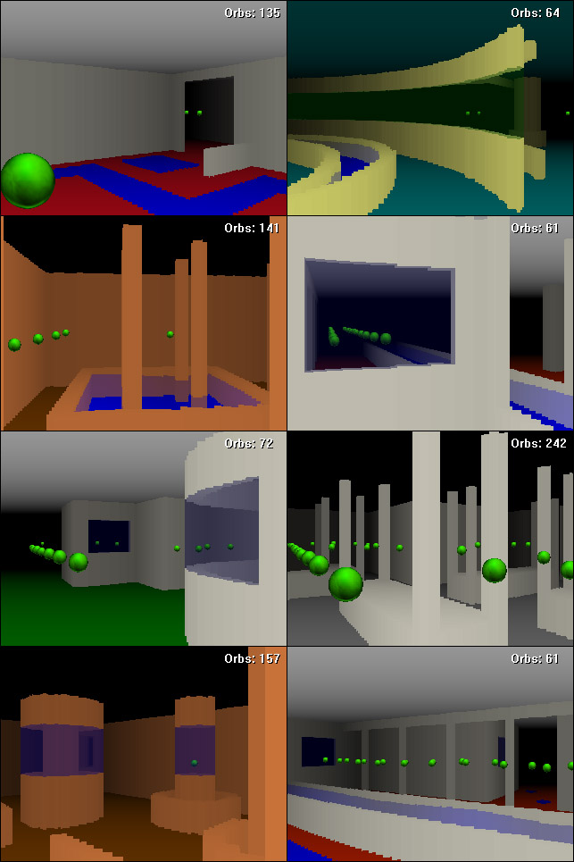



## Orby 3D RayCaster

### Description

I decided to tackle this project simply because of my curiosity in custom 3D and ray casting engines. This is a simple collect-'em-up game demonstrating the recursive raycasting engine that I have developed. It supports multi-layering for animated water and semi-transparent glass windows. It also supports simple sprites and other neat little features. This is written in purely VB and windows API, no DirectX or OpenGL. Check out the code for more detail. Do not forget to explore all corners and to take the time to enjoy the sceneries!!
 
### More Info
 
The API change resolution function may or may not work properly depending on your machine. If it fails, just try a different resolution, or if all fails, select "Don't Change" resolution.

             |
---                |---
**Submitted On**   |2006-07-09 19:55:44
**By**             |[Hou X](https://github.com/Planet-Source-Code/PSCIndex/blob/master/ByAuthor/hou-x.md)
**Level**          |Advanced
**User Rating**    |5.0 (95 globes from 19 users)
**Compatibility**  |VB 6\.0
**Category**       |[Games](https://github.com/Planet-Source-Code/PSCIndex/blob/master/ByCategory/games__1-38.md)
**World**          |[Visual Basic](https://github.com/Planet-Source-Code/PSCIndex/blob/master/ByWorld/visual-basic.md)
**Archive File**   |[Orby\_3D\_Ra200536792006\.zip](https://github.com/Planet-Source-Code/hou-x-orby-3d-raycaster__1-65909/archive/master.zip)

